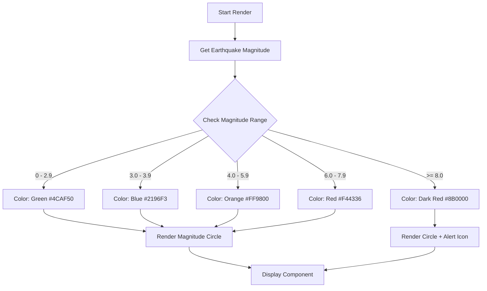

```mermaid
flowchart TD
    Start[Start Render] --> GetMag[Get Earthquake Magnitude]
    GetMag --> CheckMag{Check Magnitude Range}
    
    CheckMag -- "0 - 2.9" --> Green[Color: Green #4CAF50]
    CheckMag -- "3.0 - 3.9" --> Blue[Color: Blue #2196F3]
    CheckMag -- "4.0 - 5.9" --> Orange[Color: Orange #FF9800]
    CheckMag -- "6.0 - 7.9" --> Red[Color: Red #F44336]
    CheckMag -- ">= 8.0" --> DarkRed[Color: Dark Red #8B0000]
    
    Green & Blue & Orange & Red --> RenderCircle[Render Magnitude Circle]
    DarkRed --> RenderAlert[Render Circle + Alert Icon]
    
    RenderCircle --> Display[Display Component]
    RenderAlert --> Display
```
