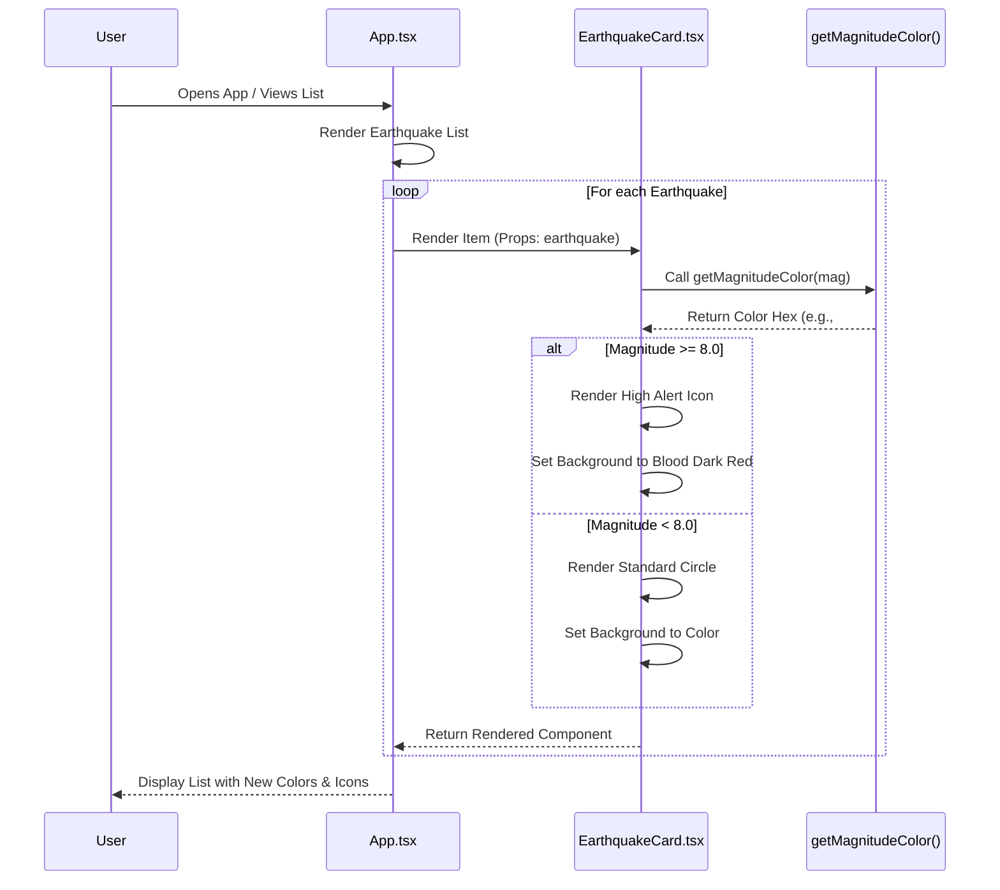

```mermaid
sequenceDiagram
    participant User
    participant App as App.tsx
    participant Card as EarthquakeCard.tsx
    participant Helper as getMagnitudeColor()

    User->>App: Opens App / Views List
    App->>App: Render Earthquake List
    loop For each Earthquake
        App->>Card: Render Item (Props: earthquake)
        Card->>Helper: Call getMagnitudeColor(mag)
        Helper-->>Card: Return Color Hex (e.g., #8B0000)
        
        alt Magnitude >= 8.0
            Card->>Card: Render High Alert Icon
            Card->>Card: Set Background to Blood Dark Red
        else Magnitude < 8.0
            Card->>Card: Render Standard Circle
            Card->>Card: Set Background to Color
        end
        
        Card-->>App: Return Rendered Component
    end
    App-->>User: Display List with New Colors & Icons
```
