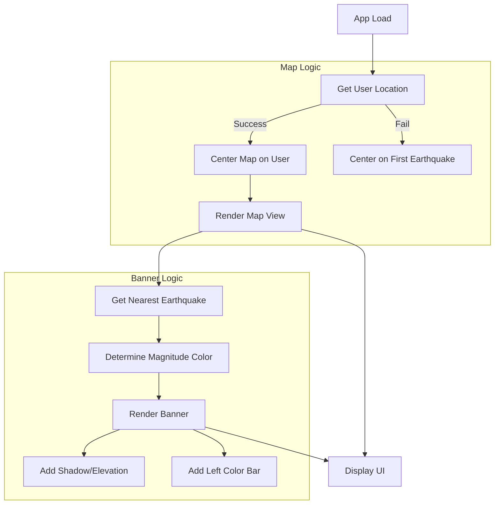

```mermaid
flowchart TD
    Start[App Load] --> GetLoc[Get User Location]
    
    subgraph Map Logic
        GetLoc -->|Success| CenterMap[Center Map on User]
        GetLoc -->|Fail| CenterEq[Center on First Earthquake]
        CenterMap --> RenderMap[Render Map View]
    end
    
    subgraph Banner Logic
        RenderMap --> GetNearest[Get Nearest Earthquake]
        GetNearest --> GetColor[Determine Magnitude Color]
        GetColor --> RenderBanner[Render Banner]
        RenderBanner --> AddShadow[Add Shadow/Elevation]
        RenderBanner --> AddBar[Add Left Color Bar]
    end
    
    RenderMap --> Display
    RenderBanner --> Display[Display UI]
```
