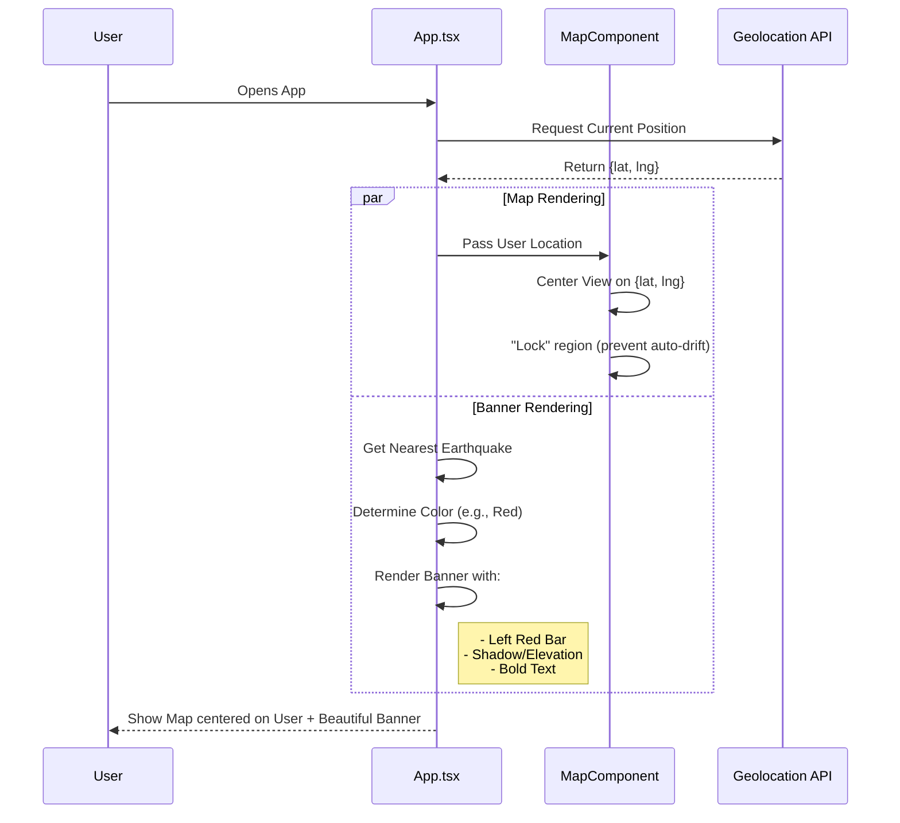

```mermaid
sequenceDiagram
    participant User
    participant App as App.tsx
    participant Map as MapComponent
    participant Geo as Geolocation API

    User->>App: Opens App
    App->>Geo: Request Current Position
    Geo-->>App: Return {lat, lng}
    
    par Map Rendering
        App->>Map: Pass User Location
        Map->>Map: Center View on {lat, lng}
        Map->>Map: "Lock" region (prevent auto-drift)
    and Banner Rendering
        App->>App: Get Nearest Earthquake
        App->>App: Determine Color (e.g., Red)
        App->>App: Render Banner with:
        Note right of App: - Left Red Bar<br/>- Shadow/Elevation<br/>- Bold Text
    end
    
    App-->>User: Show Map centered on User + Beautiful Banner
```
