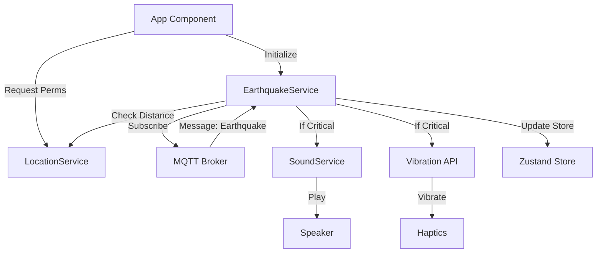

# Design: Mobile Sound Alert & MQTT Refactor

## 1. Architecture Overview

The feature enhances the `EarthquakeService` to orchestrate three key capabilities:
1.  **Connectivity**: Robust MQTT connection via a proper React Native library.
2.  **Context**: User location awareness via `LocationService`.
3.  **Feedback**: Audio/Haptic feedback via `SoundService`.



## 2. Component Design

### 2.1 SoundService
A dedicated service to handle audio lifecycle.
- **Methods**:
  - `loadSound()`: Preload the emergency siren asset.
  - `playAlert()`: Play sound (looping or single).
  - `stopAlert()`: Stop playback.
- **Implementation**: Uses `expo-av`.

### 2.2 Location Logic (in `App.tsx` / `EarthquakeService`)
- **Startup**: Check `Location.requestForegroundPermissionsAsync()`.
- **Update**: `Location.getCurrentPositionAsync()` stored in Zustand `userLocation`.
- **Distance Calc**: Haversine formula (already exists in `EarthquakeService`).

### 2.3 MQTT Client Refactor
Replace script-tag injection with `mqtt` library.
- **Polyfills**: React Native requires Node.js core modules. We will use `rn-nodeify` or manual imports for `buffer`, `process`, `events`.
- **Connection URL**:
  - Logic to determine URL:
    ```typescript
    const getBrokerUrl = () => {
      if (__DEV__) {
        // Use Expo constants to find host IP
        // e.g., 192.168.1.x or 10.0.2.2
      }
      return ENV_VAR_URL || 'ws://localhost:8083/mqtt'; // Fallback
    };
    ```

## 3. Data Flow (Alert Scenario)

1.  **Ingest**: `EarthquakeService` receives MQTT message `{ id, lat, lon, mag, ... }`.
2.  **Filter**:
    -   Get `userLocation` from Store.
    -   Calculate `distance = haversine(user, quake)`.
3.  **Decision**:
    -   `IS_NEAR` = `distance <= 100km`
    -   `IS_STRONG` = `mag >= 5.0`
    -   If `IS_NEAR && IS_STRONG`:
        -   Call `SoundService.playAlert()`.
        -   Show Modal/Banner "EMERGENCY ALERT".
4.  **Feedback**:
    -   User taps "I'm Safe" or "Dismiss".
    -   Call `SoundService.stopAlert()`.

## 4. Integration Steps

1.  **Dependencies**: Install `expo-av`, `expo-location`, `mqtt`.
2.  **Assets**: Add `siren.mp3` to `assets/sounds/`.
3.  **Permissions**: Update `app.json` (Expo config) if needed for permissions descriptions.

## 5. Testing Strategy
-   **Unit**: Test distance calculation logic.
-   **Integration**:
    -   Mock MQTT message injection.
    -   Verify SoundService `playAsync` is called.
-   **Manual**:
    -   Run Simulator.
    -   Publish MQTT message using a tool (MQTT Explorer) to `earthquakes/alerts`.
    -   Verify Sound plays.
