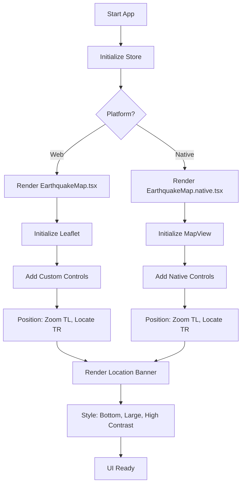

```mermaid
flowchart TD
    Start[Start App] --> InitStore[Initialize Store]
    InitStore --> CheckPlatform{Platform?}
    
    CheckPlatform -->|Web| RenderWeb[Render EarthquakeMap.tsx]
    CheckPlatform -->|Native| RenderNative[Render EarthquakeMap.native.tsx]
    
    RenderWeb --> InitLeaflet[Initialize Leaflet]
    InitLeaflet --> AddCustomControlsWeb[Add Custom Controls]
    AddCustomControlsWeb --> PosWeb[Position: Zoom TL, Locate TR]
    
    RenderNative --> InitMapView[Initialize MapView]
    InitMapView --> AddCustomControlsNative[Add Native Controls]
    AddCustomControlsNative --> PosNative[Position: Zoom TL, Locate TR]
    
    PosWeb --> RenderBanner[Render Location Banner]
    PosNative --> RenderBanner
    
    RenderBanner --> StyleBanner[Style: Bottom, Large, High Contrast]
    StyleBanner --> Ready[UI Ready]
```