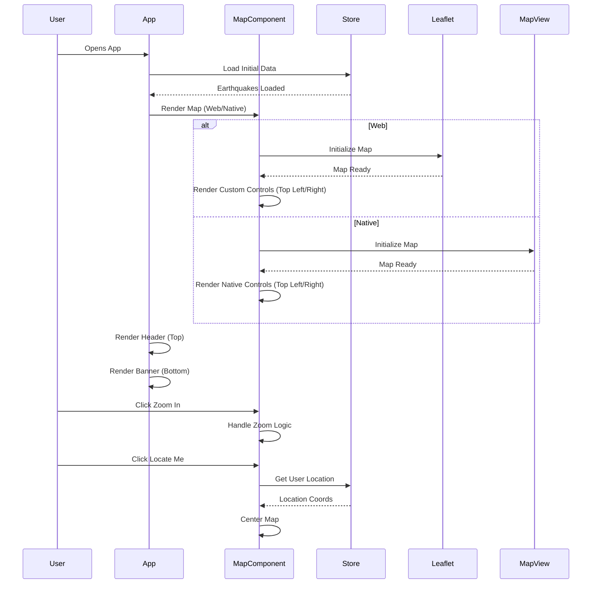

```mermaid
sequenceDiagram
    participant User
    participant App
    participant MapComponent
    participant Store

    User->>App: Opens App
    App->>Store: Load Initial Data
    Store-->>App: Earthquakes Loaded
    App->>MapComponent: Render Map (Web/Native)
    
    alt Web
        MapComponent->>Leaflet: Initialize Map
        Leaflet-->>MapComponent: Map Ready
        MapComponent->>MapComponent: Render Custom Controls (Top Left/Right)
    else Native
        MapComponent->>MapView: Initialize Map
        MapView-->>MapComponent: Map Ready
        MapComponent->>MapComponent: Render Native Controls (Top Left/Right)
    end

    App->>App: Render Header (Top)
    App->>App: Render Banner (Bottom)

    User->>MapComponent: Click Zoom In
    MapComponent->>MapComponent: Handle Zoom Logic
    
    User->>MapComponent: Click Locate Me
    MapComponent->>Store: Get User Location
    Store-->>MapComponent: Location Coords
    MapComponent->>MapComponent: Center Map
```