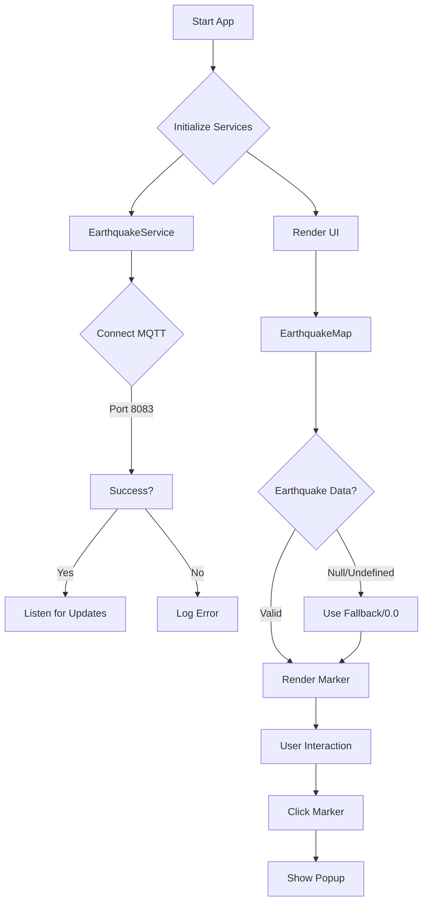

```mermaid
flowchart TD
    A[Start App] --> B{Initialize Services}
    B --> C[EarthquakeService]
    C --> D{Connect MQTT}
    D -- Port 8083 --> E[Success?]
    E -- Yes --> F[Listen for Updates]
    E -- No --> G[Log Error]
    
    B --> H[Render UI]
    H --> I[EarthquakeMap]
    I --> J{Earthquake Data?}
    J -- Valid --> K[Render Marker]
    J -- Null/Undefined --> L[Use Fallback/0.0]
    L --> K
    
    K --> M[User Interaction]
    M --> N[Click Marker]
    N --> O[Show Popup]
```
