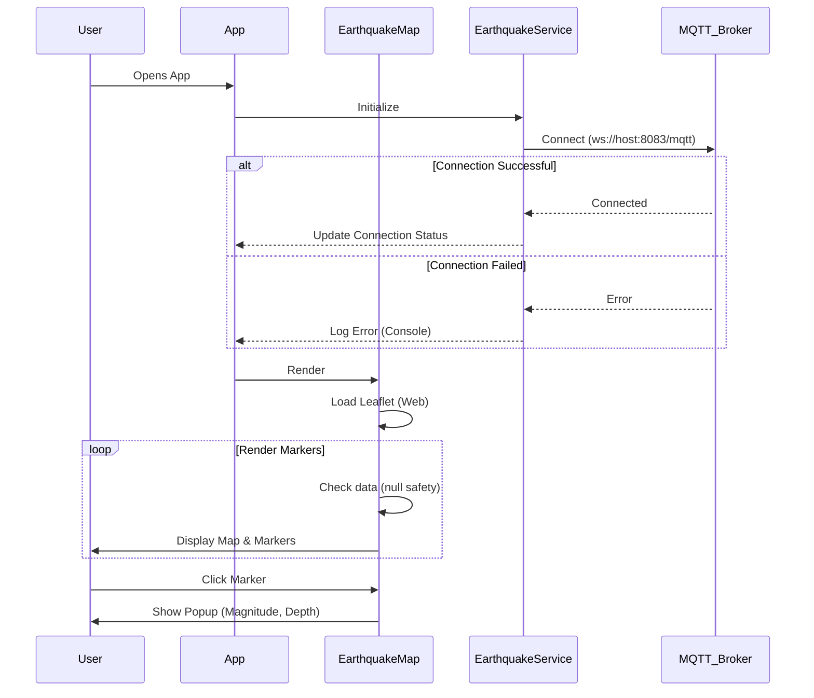

```mermaid
sequenceDiagram
    participant User
    participant App
    participant EarthquakeMap
    participant EarthquakeService
    participant MQTT_Broker

    User->>App: Opens App
    App->>EarthquakeService: Initialize
    EarthquakeService->>MQTT_Broker: Connect (ws://host:8083/mqtt)
    activate MQTT_Broker
    
    alt Connection Successful
        MQTT_Broker-->>EarthquakeService: Connected
        EarthquakeService-->>App: Update Connection Status
    else Connection Failed
        MQTT_Broker-->>EarthquakeService: Error
        EarthquakeService-->>App: Log Error (Console)
    end

    App->>EarthquakeMap: Render
    EarthquakeMap->>EarthquakeMap: Load Leaflet (Web)
    
    loop Render Markers
        EarthquakeMap->>EarthquakeMap: Check data (null safety)
        EarthquakeMap->>User: Display Map & Markers
    end

    User->>EarthquakeMap: Click Marker
    EarthquakeMap->>User: Show Popup (Magnitude, Depth)
```
